# JadeChat

SI Project files for JadeChat app.

## 1. Setting up JADE
In order for JADE Platform to run we need to install and configure jade plugins

### - Folder Structure
```bash
JadeChat
  ├── docs
  │     └─ jade-javadocs.jar
  ├── lib
  │     └─ jade.jar
  └── sources
        └─ jade-src.jar
```
Add jade.jar to build path

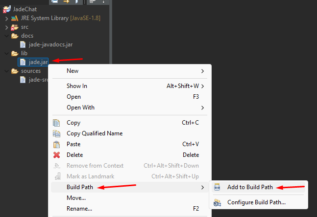

Configure Build path for Jade

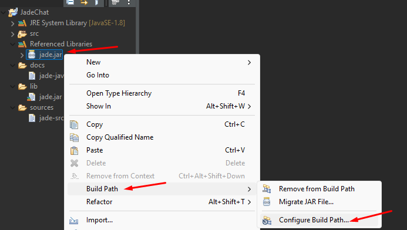

Add Sources
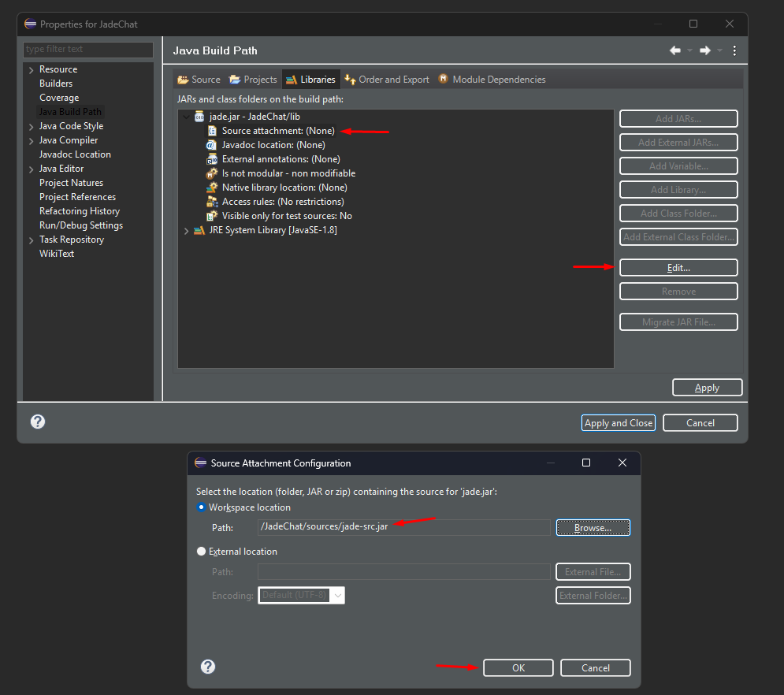

Add Javadoc
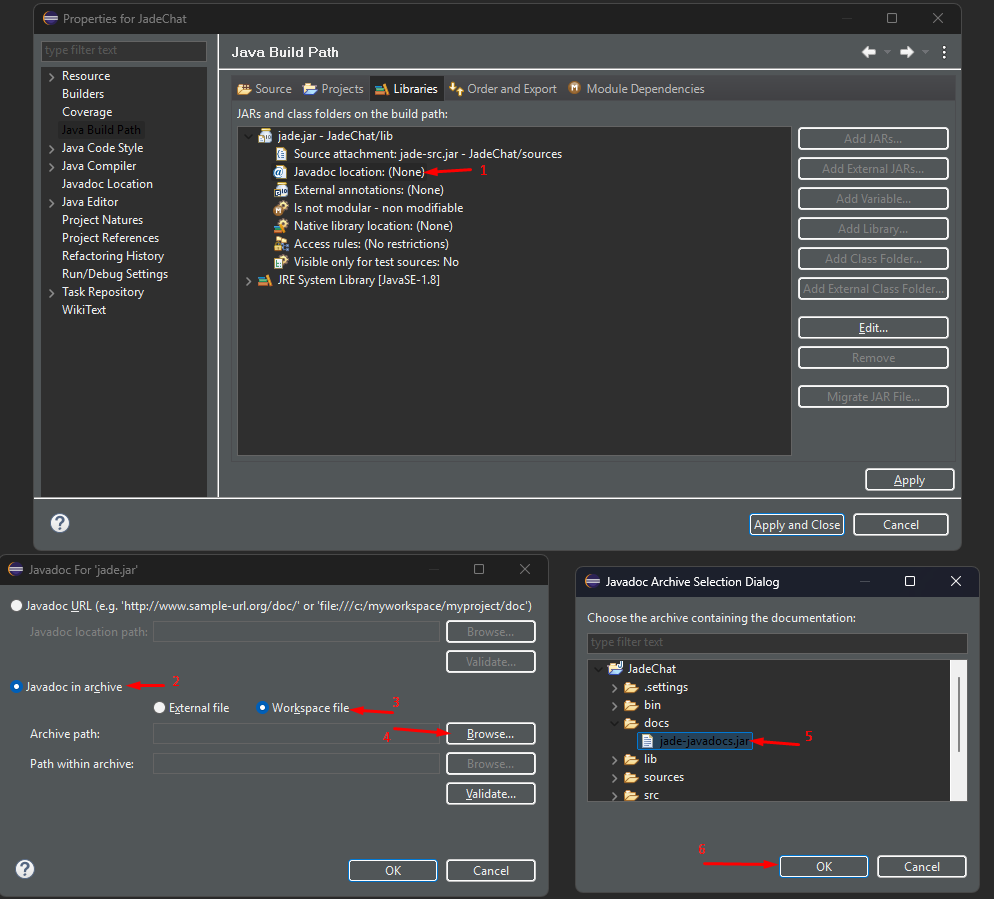

## 2. Starting up JADE platform
In order for JADE Platform to start we need to install and configure jade plugins

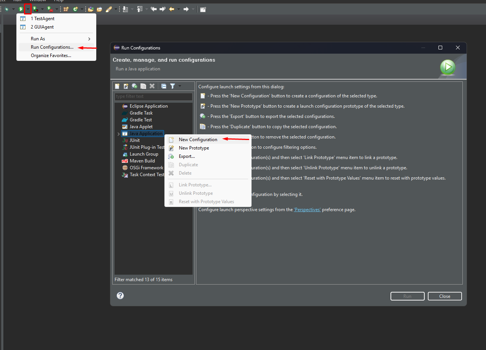

Select the jade.Boot as the main class
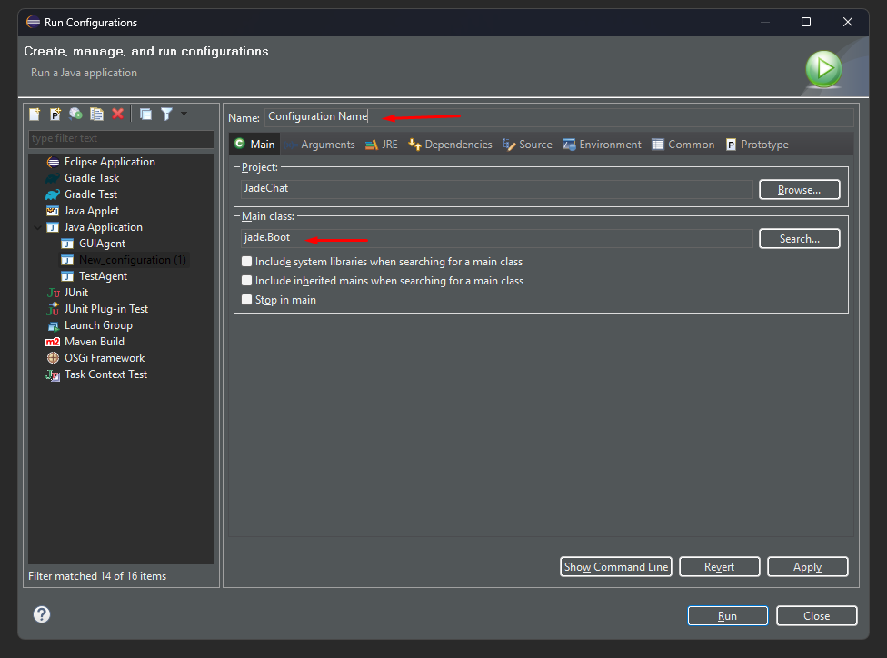

Use the following arguments
```bash
-gui -agents testAgent:feral.TestAgent -jade_domain_df_search_timeout 2000
```
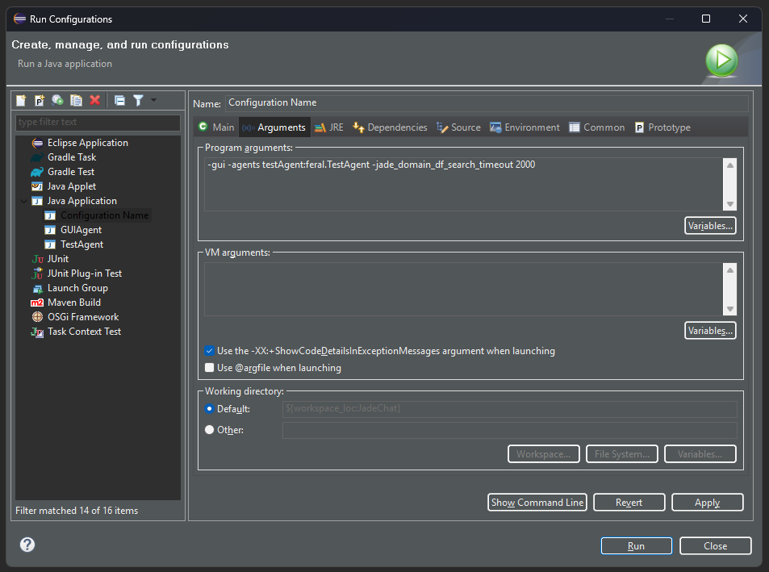

Jade Platform should be running now!
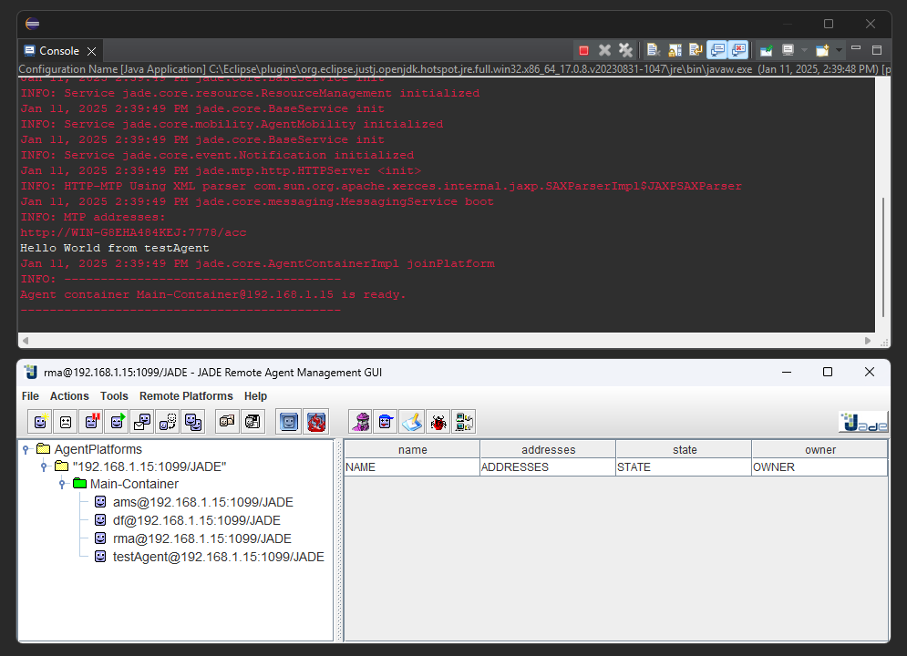


## 3. Starting up Clients
Select the MainContainer and press "Start New Agent" Button.
Fill in the Agent Name and select `feral.ChatClientAgent` for the Class Name
Finally press OK.
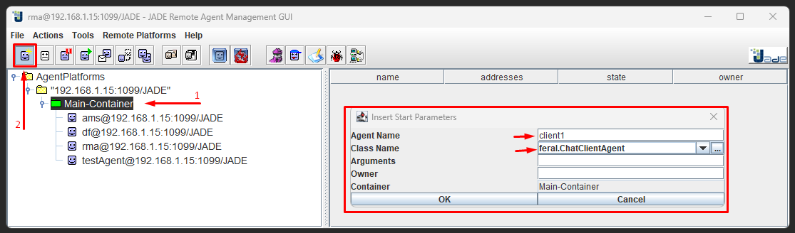

## 4. Using the clients
When the Client starts, it will try registering itself to DF.\

- You can get a list of the registered Clients pressing the "Refresh" button.\
(it will exclude your own client, so if there is only your client running the list will be empty)

- To chat with a different Client, make sure another client is running and successfully registered to DF.
- Start by pressing Refresh to populate the list with active clients, and click on the client you want to talk to.
- At the bottom you can type in the text box and send pressing the "Send" button.
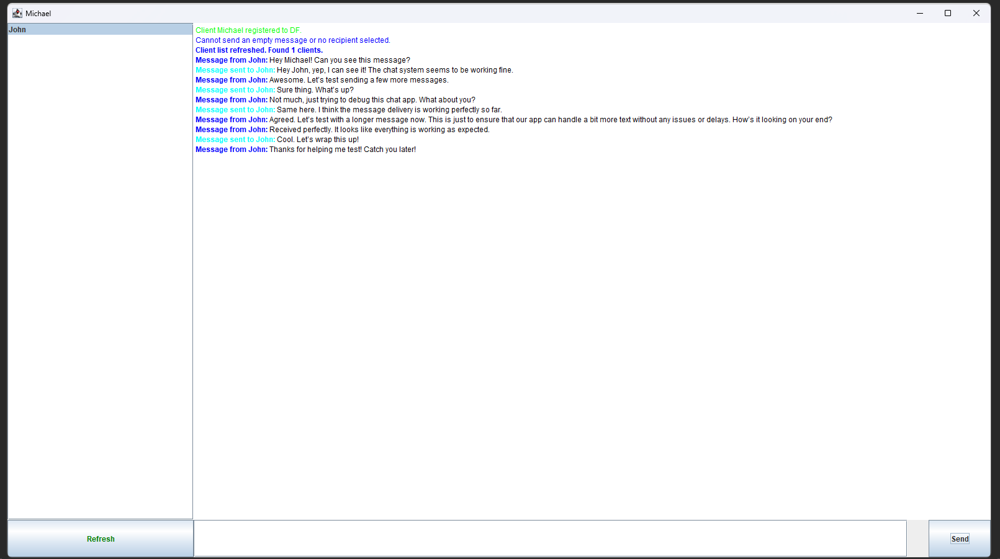

### Known Bugs
- Sometimes the List fails to update and the refresh button will be blocked until DF times out (~ 30 seconds)\
it is possible to wait for about 30 seconds and then press the Refresh button again
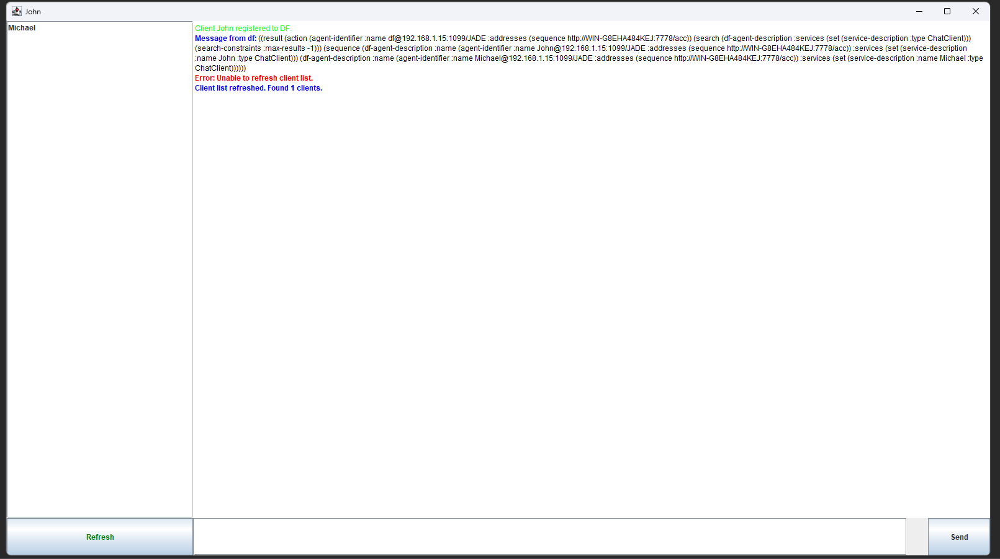


### Roadmap

- [x] Start Jade Platform
- [x] Initialize any Client dynamically
- [x] Register to DF
- [x] Send Messages
- [ ] Build a server
- [ ] Route messages through the server
- [ ] Fix Chat app being stuck on DF search
- [ ] Fix Shutting down entire jade platform when one client closes

### Some more important objectives
- [ ] Screenshots inside the Sniffer Agent to catch the used protocols
- [ ] Split the functionality into different agents and Behaviors
- [ ] Save and Resume conversations using external files